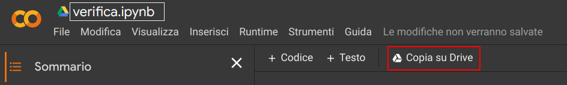

# Google Colab per C++

## Google Colab

Colab è un ambiente di sviluppo utilizzato principalmente in ricerca
che permette di scrivere codice Python tramite il browser. Più
tecnicamente, Colab è un [Jupyter Notebook](https://jupyter.org/)
hostato sui server di Google.

Di fatto, permette di

- scrivere codice Python (ed eseguirlo)
- scrviere del testo, con supporto alla matematica

su quello che viene detto un _notebook_, ovvero un file di Colab.

## Utilizzo con C++

Anche se Colab (o meglio, Jupyter), è principalmente pensato per
scrivere codice Python, è possibile tramite dei _magic commands_
accedere a funzionalità della macchina Linux sulla quale è installato.
Una di queste funzionalità è, per esempio, il compilatore.

## Setup per l'esercizio

Il notebook che vi ho condiviso ingloba del testo (principalmente
titoli per facilitare la navigazione) e delle celle di codice Python
dove invece ho scritto del codice C++.

Questo l'ho potuto fare perché, sempre sfruttando i _magic commands_,
è possibile dare comportamenti diversi alle celle di codice dove
tipicamente andrebbe del codice Python. Nel caso del comando
_writefile_, la cella viene istruita per non eseguire il codice
all'interno della cella (che non sarebbe nemmeno Python), bensì scrive
su un file il contenuto della cella.

Nell'esempio incluso di seguito si vede una cella di codice,
contenente il main dell'esercizio. In alto, all'inizio della cella il
comando `%%writefile main.cpp` istruisce la cella per salvarne il
contenuto invece che eseguirlo.

Allo stesso modo la cella per compilare ed eseguire il programma
utilizza l'interazione con il sistema operativo sul quale è installato
colab e lancia due comandi: uno per compilare
(`g++ main.cpp -std=c++11`) e l'altro per eseguire (`./a.out`) il
codice sorgente.

## Utilizzo

Le celle, ogni volta modificate devono essere rieseguite per salvarne
il contenuto. L'esecuzione può essere effettuata dal menu, tramite la
cheda _Runtime_ oppure dal tastino di _play_ posto sulla cella.

Una volta eseguita la cella restituirà un output.

## Condivisione

Colab ha un vantaggio molto grosso rispetto ai tradizionali IDE: è in
cloud. Ciò significa che il file rimane salvato sul nostro archivio di
Google Drive (per il quale serve un account Google), ma soprattutto,
che possiamo condividere il Notebook con i nostri collaboratori
proprio come se fosse un file di Drive.

Di seguito trovi le istruzioni aprire il notebook e condividerlo.

1. Apri il notebook dal link condiviso.

2. Clona il notebook sul tuo drive, così da poter effettuare modifiche
   al file.

3. Testa che il notebook funzioni. Clicca sul pulsante _Runtime_ ->
   _Esegui tutte_ e attendi che il runtime di Colab si connetta ed
   effettui l'esecuzione di tutte le celle.

4. Se il punto 3 ha successo, condividi il notebook con i tuoi
   collaboratori. Clicca sul pulsante _condividi_ in alto a destra e
   aggiungi i tuoi collaboratori tramite email. Attenzione: è
   importante aggiungere le email dei collaboratori di modo che
   possano effettuare modifiche.

5. Buon lavoro! Puoi iniziare a modificare il notebook. Ricorda di
   premere spesso `Ctrl + S` per salvare il contenuto del notebook e
   permettere ai tuoi collaboratori di vedere subito le modifiche.
